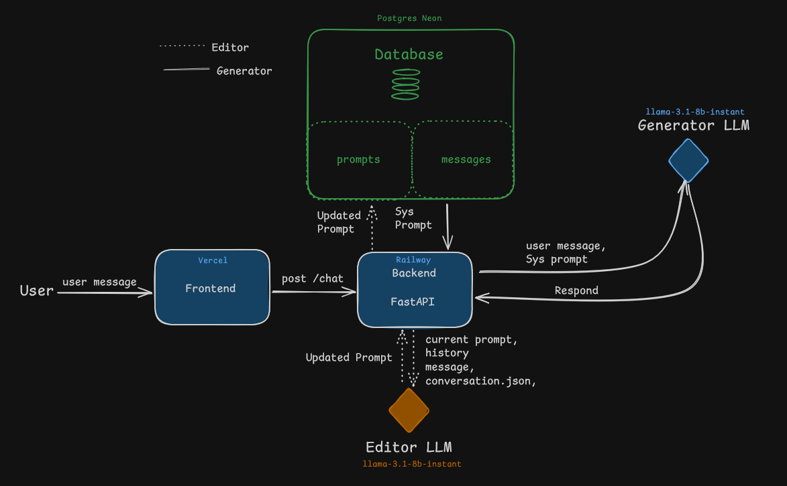

# Self-Learning Prompt Validation System

A production-deployed AI chat system with autonomous prompt evolution, version tracking, and frontend diff visualization.

---

## 🌐 Live Deployment

**Frontend (Vercel)**

[https://hackathon-issa-frontend.vercel.app/](https://hackathon-issa-frontend.vercel.app/)

**Backend (Railway)**

[https://zayar-hackathon-issa-production.up.railway.app/docs](https://zayar-hackathon-issa-production.up.railway.app/)

---

## 🚀 Overview

ISSA is an adaptive AI chat system built with:

- **FastAPI** (backend)
- **PostgreSQL (Neon)** (database)
- **Next.js + Tailwind CSS** (frontend)
- **Railway** (backend hosting)
- **Vercel** (frontend hosting)

The system supports:

- Persistent conversation storage
- Prompt versioning
- Autonomous prompt editing (triggered every 5 messages)
- Prompt preview metadata
- Frontend diff visualization for prompt updates

---

## 🧠 Core Concept

Instead of using a static system prompt, ISSA evolves its prompt automatically.

After every 5 user messages:

1. The editor analyzes interaction patterns
2. A revised prompt is generated
3. A new prompt version is stored
4. Frontend surfaces a diff preview

This creates observable “self-learning” behavior without exposing full system internals.

---

## 🏗 Architecture

### High-Level Flow

1. User sends message → `/chat`
2. Backend:
    - Fetches active prompt
    - Generates reply
    - Stores message
    - Checks edit trigger (every 5 messages)
    - Updates prompt if needed
3. Response returns:
    - `reply`
    - `prompt_version`
    - `prompt_preview`
4. Frontend:
    - Renders formatted Markdown
    - Detects version changes
    - Shows diff in corner notification

---

## Architecture Sketch



---

## 🗄 Database Structure

### `prompt` table

- `id`
- `version`
- `content`
- `created_at`

Stores versioned system prompts.

---

### `message` table

- `id`
- `session_id`
- `role` (user / assistant)
- `content`
- `created_at`

Stores full conversation history.

---

## ⚙️ Backend Design Decisions

### 1️⃣ FastAPI

Chosen for:

- Performance
- Clear dependency injection
- Async support
- Clean API structure

---

### 2️⃣ SQLAlchemy + Repository Pattern

Repositories separate:

- Data access
- Business logic
- Editor logic

This keeps the `/chat` route minimal and composable.

---

### 3️⃣ Autonomous Editing Trigger

Instead of continuous editing:

- Editing triggers every 5 user messages
- Prevents excessive DB writes
- Predictable version increments
- Stable production behavior

---

### 4️⃣ Prompt Preview Strategy

Backend returns:

```json
{
  "reply": "...",
  "prompt_version": 10,
  "prompt_preview": "Truncated preview..."
}

Only 160-character preview is returned.

Full prompt is never exposed.

Security and observability are balanced.
5️⃣ 500 Error Hardening

To ensure production reliability:

    Response model validation decoupled

    Defensive casting on metadata

    Structured exception handling

    Global exception logging

🎨 Frontend Design Decisions
Next.js + Tailwind

Chosen for:

    Rapid iteration

    Vercel-native deployment

    Clean UI composition

Markdown Rendering

Assistant messages render using:

    react-markdown

    remark-gfm

    Tailwind typography

This ensures:

    Headings render correctly

    Lists render correctly

    Code blocks render correctly

Prompt Diff Visualization

When prompt_version changes:

    Frontend compares previous preview

    Displays bottom-right diff card

    Uses word-level diff highlighting

This surfaces model evolution in real time.
🧪 Example /chat Response

{
  "reply": "Here is your formatted answer...",
  "prompt_version": 10,
  "prompt_preview": "You are a highly supportive and knowledgeable assistant..."
}

📦 Environment Variables (Backend)

DATABASE_URL=
OPENAI_API_KEY=

🛠 Running Locally

# Backend
uvicorn app.main:app --reload

# Frontend
npm run dev

```

📌 Project Status

```
✅ Backend deployed

✅ Frontend deployed

✅ Autonomous editing implemented

✅ Prompt version tracking active

✅ Diff visualization working

✅ Markdown rendering enabled

✅ Production error hardening applie
```
